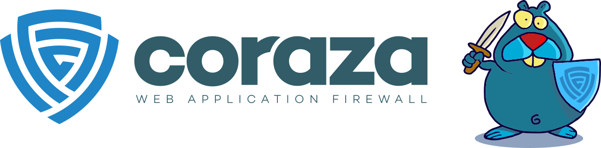

---

layout: col-sidebar
title: OWASP Coraza Web Application Firewall
tags: modsecurity coraza coraza-waf web-application-firewall waf coreruleset modsec
level: 3
type: code
pitch: OWASP Coraza is a golang enterprise-grade WAF framework compatible with Modsecurity and OWASP Core Ruleset.

---

<p align="center">
    
</p>

[](https://github.com/corazawaf/coraza/actions/workflows/go-ftw.yml)
[](https://owasp.org/www-project-coraza-web-application-firewall)

OWASP Coraza is a golang enterprise-grade Web Application Firewall framework that supports Modsecurity's seclang language and is 100% compatible with OWASP Core Ruleset.

Enrich your web application's security with powerful rules that comprehensively enforce good cybersecurity behavior. 

OWASP Coraza can be imported as a library or used with one of our connectors like [coraza-server](https://github.com/corazawaf/coraza-server) (GRPC and SPOA), [coraza-caddy](https://github.com/corazawaf/coraza-caddy) (web server, reverse proxy), [docker](#) (using connector).

## Try OWASP Coraza

Try OWASP Coraza using [OWASP Core Rule Set Sandbox]()https://coreruleset.org/docs/development/sandbox/ or the [Coraza Playground](https://playground.coraza.io/).

```sh
curl -H "x-format-output: txt-matched-rules" \
 -H "x-backend: coraza-caddy" \
"https://sandbox.coreruleset.org/?search=<script>alert('CRS+Sandbox+Release')</script>"
```

## Take control of your applications

Control your requests and response before processing by your server or your customer's browser by submitting the content to our 4 "phase processors."


Parse multiple content types, like XML, JSON, Multipart, and urlencoded, and don't miss anything. Coraza can transform all of this into easily manageable variables.

Extend OWASP Coraza to achieve anything; our plugin framework allows you to extend any capability, like operators, actions, directives, body processors, and audit engines.

Don't miss anything; log everything you need in order to achieve compliance and complete visibility of your applications.

## Communication channels

- [OWASP Slack](https://owasp.org/slack/invite) #coraza 
- [Github Discussions](https://github.com/corazawaf/coraza/discussions)
- [Monthly Meeting](https://github.com/corazawaf/coraza/issues?q=label%3Ameeting+)


## Documentation

We have [extensive documentation](https://coraza.io) on integration, directives supported and additional usage patterns.

## Licensing

OWASP Coraza Web Application Firewall is free to use. It is licensed under the Apache Software License version 2 (ASLv2), so you can copy, distribute and transmit the work, and you can adapt it and use it commercially. Still, all provided that you attribute the work and if you alter, transform, or build upon this work, you may distribute the resulting work only under the same or similar license to this one.
